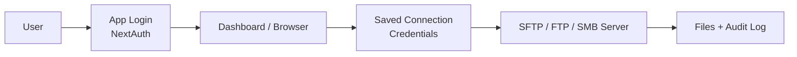

# Multi-Tenant File Protocol SaaS

A Next.js + TypeScript app that acts as a secure gateway to SFTP, FTP, and SMB servers. It includes app-level login, per-connection credentials, audit logging, and a unified file browser.

## Architecture



## Run the app

### Docker

```bash
docker compose up -d --build
```

Open: http://localhost:3000

### Local development

```bash
npm install
npm run db:init
npm run dev
```

### Environment

Required variables are in `.env`:

- `NEXTAUTH_SECRET`
- `ENCRYPTION_KEY`
- `NEXTAUTH_URL`
- `DATABASE_PATH`

## Login

Test users are seeded automatically.

- Admin: `admin@example.com` / `adminpass123`
- Member: `member@example.com` / `memberpass123`

## Backend endpoints

| Method         | Endpoint                  | Purpose                        | Auth       |
| -------------- | ------------------------- | ------------------------------ | ---------- |
| `GET` / `POST` | `/api/auth/[...nextauth]` | NextAuth login/session flow    | No         |
| `GET`          | `/api/auth/csrf`          | CSRF token for login           | No         |
| `GET`          | `/api/auth/session`       | Current session info           | No         |
| `GET`          | `/api/health`             | Health check                   | No         |
| `GET`          | `/api/connections`        | List saved connections         | Yes        |
| `POST`         | `/api/connections`        | Create a connection            | Yes        |
| `POST`         | `/api/connections/test`   | Test remote connection details | Yes        |
| `PUT`          | `/api/connections/[id]`   | Update a connection            | Yes        |
| `DELETE`       | `/api/connections/[id]`   | Delete a connection            | Yes        |
| `GET`          | `/api/fs/list`            | List files and folders         | Yes        |
| `GET`          | `/api/fs/download`        | Download a file                | Yes        |
| `POST`         | `/api/fs/upload`          | Upload a file                  | Yes        |
| `DELETE`       | `/api/fs/delete`          | Delete a file or folder        | Yes        |
| `POST`         | `/api/fs/rename`          | Rename a file or folder        | Yes        |
| `GET`          | `/api/audit`              | View audit logs                | Admin only |

## Bash verification

The commands below assume the Docker app is running on `http://localhost:3000`.
They sign in as admin, create a test connection, and verify the file APIs.

```bash
set -euo pipefail
BASE=http://localhost:3000
COOKIE=/tmp/mft-cookie.txt

# 1) Sign in and keep the session cookie
csrf=$(curl -s -c "$COOKIE" "$BASE/api/auth/csrf" | node -e 'const fs=require("fs"); process.stdout.write(JSON.parse(fs.readFileSync(0,"utf8")).csrfToken)')
curl -s -b "$COOKIE" -c "$COOKIE" -X POST "$BASE/api/auth/callback/credentials?json=true" \
  -H 'Content-Type: application/x-www-form-urlencoded' \
  --data-urlencode "csrfToken=$csrf" \
  --data-urlencode "email=admin@example.com" \
  --data-urlencode "password=adminpass123" \
  --data-urlencode "json=true" \
  --data-urlencode "callbackUrl=$BASE/dashboard" >/dev/null

# 2) Session + health
curl -s "$BASE/api/health"
curl -s -b "$COOKIE" "$BASE/api/auth/session"

# 3) Create a temporary connection and capture its ID
CONNECTION_ID=$(curl -s -b "$COOKIE" -X POST "$BASE/api/connections" \
  -H 'Content-Type: application/json' \
  -d '{"name":"README Test SFTP","protocol":"sftp","host":"sftp_server","port":22,"username":"testuser","password":"pass123"}' \
  | node -e 'const fs=require("fs"); process.stdout.write(String(JSON.parse(fs.readFileSync(0,"utf8")).id))')

echo "Connection ID: $CONNECTION_ID"

# 4) Connection endpoints
curl -s -b "$COOKIE" "$BASE/api/connections"
curl -s -b "$COOKIE" -X POST "$BASE/api/connections/test" \
  -H 'Content-Type: application/json' \
  -d '{"name":"Test SFTP","protocol":"sftp","host":"sftp_server","port":22,"username":"testuser","password":"pass123"}'
curl -s -b "$COOKIE" -X PUT "$BASE/api/connections/$CONNECTION_ID" \
  -H 'Content-Type: application/json' \
  -d '{"name":"README Test SFTP Updated"}'

# 5) File APIs
printf 'hello from the README' > /tmp/mft-upload.txt
curl -s -b "$COOKIE" -X GET "$BASE/api/fs/list?connectionId=$CONNECTION_ID&path=/"
curl -s -b "$COOKIE" -X POST "$BASE/api/fs/upload" \
  -F "connectionId=$CONNECTION_ID" \
  -F "path=/upload" \
  -F "file=@/tmp/mft-upload.txt"
curl -s -b "$COOKIE" -o /tmp/mft-downloaded.txt \
  "$BASE/api/fs/download?connectionId=$CONNECTION_ID&path=/upload/mft-upload.txt"
curl -s -b "$COOKIE" -X POST "$BASE/api/fs/rename?connectionId=$CONNECTION_ID" \
  -H 'Content-Type: application/json' \
  -d '{"from":"/upload/mft-upload.txt","to":"/upload/mft-upload-renamed.txt"}'
curl -i -b "$COOKIE" -X DELETE "$BASE/api/fs/delete?connectionId=$CONNECTION_ID&path=/upload/mft-upload-renamed.txt"

# 6) Admin audit log
curl -s -b "$COOKIE" "$BASE/api/audit"

# 7) Cleanup
curl -i -b "$COOKIE" -X DELETE "$BASE/api/connections/$CONNECTION_ID"
```

## Notes

- Remote connection credentials are stored per connection and are separate from the app login.
- The app uses audit logging for file operations.
- Connection passwords are encrypted before storage.
